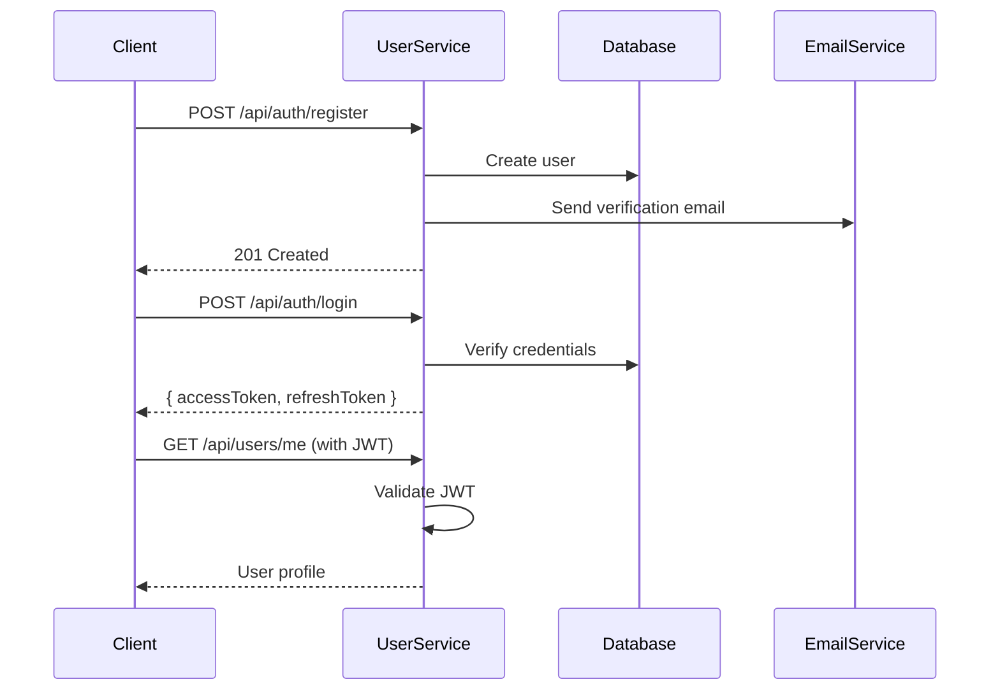
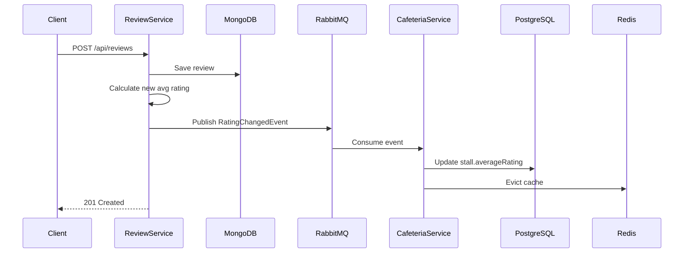

# NUSHungry Backend - Microservices Architecture

[](https://spring.io/projects/spring-boot)
[](https://www.oracle.com/java/)
[](https://www.postgresql.org/)
[](https://www.mongodb.com/)
[](https://redis.io/)
[](https://www.rabbitmq.com/)
[](LICENSE)

> A scalable microservices-based backend system for NUSHungry, a cafeteria and food stall discovery platform for National University of Singapore (NUS).

## 🎯 Project Overview

NUSHungry Backend is a production-ready microservices architecture designed to support a food discovery and review platform. The system enables users to:

- 🔐 Register, authenticate, and manage accounts with JWT-based security
- 🏢 Browse cafeterias and food stalls with detailed information
- ⭐ Create, read, update, and delete reviews with ratings and images
- ❤️ Save favorite stalls and maintain search history
- 📸 Upload and manage media files
- 🛡️ Report inappropriate content and admin moderation
- 📊 View aggregated ratings, pricing, and statistics

The architecture emphasizes **scalability**, **maintainability**, and **loose coupling** through modern microservices patterns.

---

## 🏗️ System Architecture

### Microservices Overview

| Service | Port | Database | Description |
|---------|------|----------|-------------|
| **user-service** | 8081 | PostgreSQL | User authentication, JWT tokens, password reset, email verification |
| **cafeteria-service** | 8083 | PostgreSQL + Redis | Cafeteria & stall directory, search, caching, rating aggregation |
| **review-service** | 8084 | MongoDB | Review management, likes, reports, rating/price calculation |
| **media-service** | 8085 | PostgreSQL | Image upload, storage, and serving |
| **preference-service** | 8086 | PostgreSQL + Redis | User favorites, search history, custom ordering |

### Technology Stack

#### Backend Frameworks
- **Spring Boot 3.2.3** - Application framework
- **Spring Data JPA** - PostgreSQL data access
- **Spring Data MongoDB** - NoSQL data access
- **Spring Security** - Authentication & authorization
- **Spring AMQP** - RabbitMQ integration
- **Spring Cache** - Redis caching abstraction

#### Databases & Storage
- **PostgreSQL 16** - Relational data (users, cafeterias, stalls, media metadata)
- **MongoDB 7** - Document store (reviews, likes, reports)
- **Redis 7** - Distributed cache and session storage
- **MinIO** - S3-compatible object storage (optional)

#### Messaging & Monitoring
- **RabbitMQ 3.12** - Event-driven communication between services
- **Micrometer + Prometheus** - Metrics collection
- **Logstash Logback Encoder** - Structured JSON logging
- **Spring Boot Actuator** - Health checks and metrics endpoints

#### API & Documentation
- **SpringDoc OpenAPI 3** - Swagger UI and API documentation
- **JWT (jjwt 0.11.5)** - Stateless authentication

#### Development Tools
- **Lombok** - Reduce boilerplate code
- **Maven** - Build and dependency management
- **Docker & Docker Compose** - Containerization
- **JaCoCo** - Code coverage reports
- **SpotBugs & OWASP Dependency Check** - Security analysis

---

## 📂 Project Structure

```
NUSHungry-Backend-microservices/
├── user-service/              # User management & authentication
│   ├── src/
│   ├── pom.xml
│   └── Dockerfile
├── cafeteria-service/         # Cafeteria & stall directory
│   ├── src/
│   ├── pom.xml
│   └── Dockerfile
├── review-service/            # Review & rating system
│   ├── src/
│   ├── pom.xml
│   └── Dockerfile
├── media-service/             # Media file management
│   ├── src/
│   ├── pom.xml
│   └── Dockerfile
├── preference-service/        # User preferences & favorites
│   ├── src/
│   ├── pom.xml
│   └── Dockerfile
├── docker-compose.yml         # Infrastructure orchestration
├── .env.example               # Environment variables template
├── nushungry_db_backup.sql    # Database schema and seed data
└── README.md
```

---

## 🚀 Quick Start

### Prerequisites

- **Java 17** or higher
- **Maven 3.8+**
- **Docker & Docker Compose** (recommended)
- **PostgreSQL 16** (if not using Docker)
- **MongoDB 7** (if not using Docker)
- **Redis 7** (if not using Docker)
- **RabbitMQ 3.12** (if not using Docker)

### 1. Clone the Repository

```bash
git clone https://github.com/SWE5006-Group-7/NUSHungry-Backend-microservices.git
cd NUSHungry-Backend-microservices
```

### 2. Configure Environment Variables

```bash
cp .env.example .env
# Edit .env with your database credentials and secrets
```

**Key Configuration:**
- `POSTGRES_USER` / `POSTGRES_PASSWORD` - PostgreSQL credentials
- `MONGO_USER` / `MONGO_PASSWORD` - MongoDB credentials
- `JWT_SECRET` - JWT signing key (min 256 bits for production)
- `RABBITMQ_USER` / `RABBITMQ_PASSWORD` - RabbitMQ credentials
- `MINIO_USER` / `MINIO_PASSWORD` - MinIO object storage credentials

### 3. Start Infrastructure Services (Docker)

```bash
# Start PostgreSQL, MongoDB, Redis, RabbitMQ, MinIO
docker-compose up -d
```

**Verify Services:**
```bash
# PostgreSQL
docker exec -it nushungry-postgres psql -U postgres -c "SELECT version();"

# MongoDB
docker exec -it nushungry-mongodb mongosh --eval "db.version()"

# Redis
docker exec -it nushungry-redis redis-cli ping

# RabbitMQ Management UI
open http://localhost:15672  # guest/guest

# MinIO Console
open http://localhost:9001    # minioadmin/minioadmin
```

### 4. Initialize Databases

```bash
# PostgreSQL schema and seed data
docker exec -i nushungry-postgres psql -U postgres < nushungry_db_backup.sql

# MongoDB indexes (optional, auto-created on first run)
# Review service will create indexes automatically
```

### 5. Build and Run Services

#### Option A: Run All Services with Maven

```bash
# Terminal 1 - User Service
cd user-service
mvn spring-boot:run

# Terminal 2 - Cafeteria Service
cd cafeteria-service
mvn spring-boot:run

# Terminal 3 - Review Service
cd review-service
mvn spring-boot:run

# Terminal 4 - Media Service
cd media-service
mvn spring-boot:run

# Terminal 5 - Preference Service
cd preference-service
mvn spring-boot:run
```

#### Option B: Build JARs and Run

```bash
# Build all services
mvn clean package -DskipTests

# Run services
java -jar user-service/target/user-service-0.0.1-SNAPSHOT.jar &
java -jar cafeteria-service/target/cafeteria-service-0.0.1-SNAPSHOT.jar &
java -jar review-service/target/review-service-0.0.1-SNAPSHOT.jar &
java -jar media-service/target/media-service-0.0.1-SNAPSHOT.jar &
java -jar preference-service/target/preference-service-0.0.1-SNAPSHOT.jar &
```

#### Option C: Docker Compose (Full Stack)

```bash
# TODO: Add service Dockerfiles to docker-compose.yml
docker-compose -f docker-compose.full.yml up --build
```

### 6. Verify Services

```bash
# Health checks
curl http://localhost:8081/api/actuator/health  # User Service
curl http://localhost:8083/actuator/health      # Cafeteria Service
curl http://localhost:8084/actuator/health      # Review Service
curl http://localhost:8085/actuator/health      # Media Service
curl http://localhost:8086/actuator/health      # Preference Service
```

### 7. Access API Documentation

- **User Service Swagger**: http://localhost:8081/api/swagger-ui.html
- **Cafeteria Service Swagger**: http://localhost:8083/swagger-ui.html
- **Review Service Swagger**: http://localhost:8084/swagger-ui.html
- **Media Service Swagger**: http://localhost:8085/swagger-ui.html
- **Preference Service Swagger**: http://localhost:8086/swagger-ui.html

---

## 📡 API Overview

### Authentication Flow



### Review Creation & Rating Update Flow



### Key Endpoints

#### User Service (Port 8081)
- `POST /api/auth/register` - User registration
- `POST /api/auth/login` - User login
- `POST /api/auth/refresh` - Refresh access token
- `GET /api/users/me` - Get current user profile
- `PUT /api/users/me/password` - Change password
- `POST /api/password-reset/send-code` - Send reset code via email

#### Cafeteria Service (Port 8083)
- `GET /api/cafeterias` - List all cafeterias
- `GET /api/cafeterias/{id}/stalls` - Get stalls in cafeteria
- `GET /api/stalls/search` - Search stalls (keyword, rating, price)
- `POST /api/admin/stalls` - Create stall (admin only)

#### Review Service (Port 8084)
- `POST /api/reviews` - Create review
- `GET /api/reviews/stall/{stallId}` - Get stall reviews
- `POST /api/reviews/{id}/like` - Toggle like
- `POST /api/reviews/{id}/report` - Report review
- `GET /api/admin/reports` - List all reports (admin)

#### Media Service (Port 8085)
- `POST /media/upload` - Upload image
- `GET /media/{fileName}` - Serve image
- `DELETE /media/admin/images/{id}` - Delete image (admin)

#### Preference Service (Port 8086)
- `POST /preference/favorite/add` - Add favorite stall
- `GET /preference/favorite/list` - Get user favorites
- `POST /preference/search-history/add` - Save search history
- `DELETE /preference/search-history/clear` - Clear history

---

## 🔒 Security

### Authentication & Authorization

- **JWT-based stateless authentication** with access and refresh tokens
- **Access token expiration**: 1 hour (configurable)
- **Refresh token expiration**: 30 days (configurable)
- **BCrypt password hashing** with salt rounds = 10
- **Role-based access control** (ROLE_USER, ROLE_ADMIN)`

