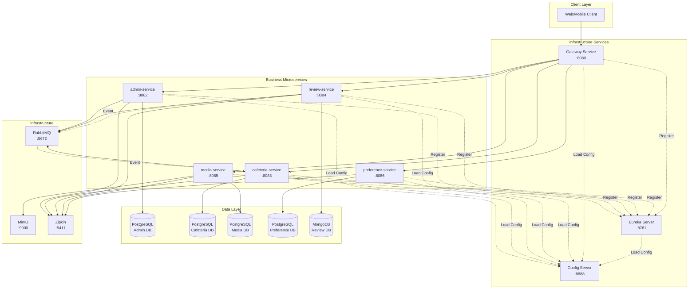

# NUSHungry Backend - Microservices Architecture

Backend system for the NUSHungry application, implemented using a microservices architecture with Spring Boot, Docker, and message-driven communication.

## 📋 Table of Contents
- [System Architecture](#system-architecture)
- [Microservices Overview](#microservices-overview)
- [Technology Stack](#technology-stack)
- [Quick Start](#quick-start)
- [Project Structure](#project-structure)
- [Documentation](#documentation)

---

## 🏗️ System Architecture

The NUSHungry backend implements a **distributed microservices architecture** with centralized configuration management, designed for multi-server deployment and horizontal scalability.



### Architecture Principles
- **Service Independence**: Each microservice has its own database and can be deployed independently on different servers
- **Centralized Configuration**: Config Server manages all service configurations with environment-specific profiles (dev/prod)
- **Service Discovery**: Eureka Server enables dynamic service registration and discovery across multiple hosts
- **API Gateway**: Single entry point for all client requests with routing, authentication, and rate limiting
- **Event-Driven**: Services communicate asynchronously via RabbitMQ for loose coupling
- **Polyglot Persistence**: PostgreSQL for relational data, MongoDB for document-based reviews
- **Distributed Tracing**: Zipkin integration for end-to-end request tracking across services
- **Containerization**: Docker-based deployment for consistency and portability

---

## 🚀 Microservices Overview

| Service | Port | Database | Status | Description |
|---------|------|----------|--------|-------------|
| **admin-service** | 8082 | PostgreSQL (5432) | ✅ Production | User management, authentication (JWT), admin dashboard |
| **cafeteria-service** | 8083 | PostgreSQL (5433) | ✅ Production | Cafeteria and stall management, ratings aggregation |
| **review-service** | 8084 | MongoDB (27017) | ✅ Production | Review creation, likes, comments (event publisher) |
| **media-service** | 8085 | PostgreSQL (5434) | ✅ Production | Image/file uploads, processing, storage (MinIO) |
| **preference-service** | 8086 | PostgreSQL (5435) | ✅ Production | User favorites, search history |

### Key Features by Service

#### 🔐 admin-service
- JWT-based authentication & authorization
- User CRUD operations
- Role-based access control (Admin/User)
- Dashboard statistics aggregation
- Password reset with email verification
- RabbitMQ event consumption

#### 🍽️ cafeteria-service
- Cafeteria and stall information management
- Geographic location support (coordinates)
- Operating hours management
- Real-time rating aggregation (via RabbitMQ events)
- Image association with cafeterias/stalls
- Advanced search and filtering

#### ⭐ review-service
- Review creation, update, deletion
- Like/unlike functionality
- Comment system (nested replies)
- MongoDB for flexible document storage
- Event publishing to RabbitMQ (rating updates)
- Full-text search capabilities

#### 📸 media-service
- Multi-format image upload (JPEG, PNG, WebP)
- Image processing (resizing, compression)
- MinIO object storage integration
- File metadata tracking
- Association with cafeterias/stalls/reviews

#### ❤️ preference-service
- User favorites management
- Search history tracking
- Batch operations (add/remove multiple favorites)
- Privacy-focused (user data isolation)

---

## 🛠️ Technology Stack

### Core Framework
- **Spring Boot**: 3.2.3
- **Java**: 17 (LTS)
- **Build Tool**: Maven

### Databases
- **PostgreSQL**: 14+ (Relational data)
- **MongoDB**: 6.0+ (Document storage)

### Message Queue
- **RabbitMQ**: 3.12+ (Async communication)

### Storage
- **MinIO**: Latest (Object storage for media files)

### Containerization
- **Docker**: 20.10+
- **Docker Compose**: 2.x

### Security
- **Spring Security**: JWT authentication
- **BCrypt**: Password hashing

### Documentation
- **Swagger/OpenAPI**: 3.0 (API documentation)

### Testing
- **JUnit 5**: Unit testing
- **Mockito**: Mocking framework
- **TestContainers**: Integration testing

### CI/CD
- **GitHub Actions**: Automated CI/CD pipeline
- **AWS ECS**: Production deployment

---

## ⚡ Quick Start

### Prerequisites

- **Java**: 17 or higher
- **Maven**: 3.8+
- **Docker**: 20.10+ (with Docker Compose)
- **Git**: For version control

### 🎯 Deployment Options

#### Option 1: Local Development (Single Service)

For local development and testing of individual services:

```bash
# 1. Start infrastructure services first
cd config-server
docker compose up -d
cd ../eureka-server
docker compose up -d

# 2. Start a specific service with its dependencies
cd ../cafeteria-service
docker compose up -d

# 3. Check service health
docker compose ps
curl http://localhost:8083/actuator/health
```

**Each service has its own `docker-compose.yml` for isolated development.**

#### Option 2: Distributed Production Deployment

For multi-server production deployment:

**Server 1 (Infrastructure)**:
```bash
# Deploy Config Server and Eureka Server
cd config-server && docker compose -f docker-compose.yml up -d
cd eureka-server && docker compose -f docker-compose.yml up -d
cd gateway-service && docker compose -f docker-compose.yml up -d
```

**Server 2 (Business Services)**:
```bash
# Configure environment variables to point to Server 1
export EUREKA_HOST=<server-1-ip>
export CONFIG_SERVER_URI=http://<server-1-ip>:8888

# Deploy business services
cd admin-service && docker compose -f docker-compose.yml up -d
cd cafeteria-service && docker compose -f docker-compose.yml up -d
```

**Server 3 (Business Services)**:
```bash
export EUREKA_HOST=<server-1-ip>
export CONFIG_SERVER_URI=http://<server-1-ip>:8888

cd review-service && docker compose -f docker-compose.yml up -d
cd media-service && docker compose -f docker-compose.yml up -d
cd preference-service && docker compose -f docker-compose.yml up -d
```

> **Note**: See [`docs/DEPLOYMENT.md`](docs/DEPLOYMENT.md) for complete multi-server deployment guide.

**Service Access Points:**
- Gateway (Single Entry): http://gateway-server:8080
- Config Server: http://config-server:8888
- Eureka Dashboard: http://eureka-server:8761
- Admin Service: http://localhost:8082
- Cafeteria Service: http://localhost:8083
- Review Service: http://localhost:8084
- Media Service: http://localhost:8085
- Preference Service: http://localhost:8086

#### Option 3: Manual Build & Run

```bash
# Build all services
mvn clean install -DskipTests

# Run a specific service with Config Server support
cd admin-service
export CONFIG_SERVER_URI=http://localhost:8888
export SPRING_PROFILES_ACTIVE=dev
mvn spring-boot:run
```

### 📊 Verify Deployment

```bash
# Health checks
curl http://localhost:8082/actuator/health  # admin-service
curl http://localhost:8083/actuator/health  # cafeteria-service
curl http://localhost:8084/actuator/health  # review-service
curl http://localhost:8085/actuator/health  # media-service
curl http://localhost:8086/actuator/health  # preference-service
```

### 🗄️ Database Initialization

Databases are automatically initialized when services start. To manually initialize:

```bash
# Run initialization scripts (if needed)
cd <service-name>/scripts
psql -U postgres -d <database-name> -f init_<service>_db.sql
```

---

## 📁 Project Structure

```
nushungry-Backend/
├── admin-service/               # User management & authentication
│   ├── src/
│   ├── Dockerfile
│   ├── docker-compose.yml
│   ├── DEPLOYMENT.md
│   └── scripts/
│       ├── init_admin_db.sql
│       ├── MIGRATION_GUIDE.md
│       └── start-services.sh/bat
│
├── cafeteria-service/           # Cafeteria & stall management
│   ├── src/
│   ├── Dockerfile
│   ├── docker-compose.yml
│   ├── DEPLOYMENT.md
│   └── scripts/
│       ├── init_cafeteria_db.sql
│       ├── MIGRATION_GUIDE.md
│       └── start-services.sh/bat
│
├── review-service/              # Reviews, likes & comments
│   ├── src/
│   ├── Dockerfile
│   ├── docker-compose.yml
│   ├── DEPLOYMENT.md
│   └── scripts/
│       ├── migrate_reviews_to_mongodb.py
│       ├── MIGRATION_GUIDE.md
│       └── start-services.sh/bat
│
├── media-service/               # Image uploads & processing
│   ├── src/
│   ├── Dockerfile
│   ├── docker-compose.yml
│   ├── DEPLOYMENT.md
│   └── scripts/
│       ├── init_media_db.sql
│       ├── MIGRATION_GUIDE.md
│       └── start-services.sh/bat
│
├── preference-service/          # Favorites & search history
│   ├── src/
│   ├── Dockerfile
│   ├── docker-compose.yml
│   ├── DEPLOYMENT.md
│   └── scripts/
│       ├── init_preference_db.sql
│       ├── MIGRATION_GUIDE.md
│       └── start-services.sh/bat
│
├── src/                         # Legacy monolith (deprecated)
├── docs/                        # System documentation
│   ├── ARCHITECTURE.md          # Architecture details
│   ├── DEVELOPMENT.md           # Development guide
│   └── API_DOCUMENTATION.md     # API reference
│
├── scripts/                     # Global scripts
│   ├── start-all-services.sh/bat
│   └── stop-all-services.sh/bat
│
├── .github/workflows/           # CI/CD pipelines
│   ├── ci.yml
│   └── cd.yml
│
├── docker-compose.yml           # Global orchestration
├── .env.example                 # Environment variables template
├── pom.xml                      # Parent POM (optional)
├── PROGRESS.md                  # Migration progress tracking
└── README.md                    # This file
```

### Service Structure (Example: cafeteria-service)

```
cafeteria-service/
├── src/
│   ├── main/
│   │   ├── java/com/nushungry/cafeteriaservice/
│   │   │   ├── controller/       # REST endpoints
│   │   │   ├── service/          # Business logic
│   │   │   ├── repository/       # Data access
│   │   │   ├── model/            # JPA entities
│   │   │   ├── dto/              # Data transfer objects
│   │   │   ├── event/            # RabbitMQ listeners
│   │   │   ├── config/           # Configuration classes
│   │   │   └── CafeteriaServiceApplication.java
│   │   └── resources/
│   │       ├── application.properties
│   │       └── application-docker.properties
│   └── test/
│       └── java/                 # Unit & integration tests
├── Dockerfile
├── docker-compose.yml
└── DEPLOYMENT.md
```

---

## 📖 Documentation

### Core Documents
- **[ARCHITECTURE.md](docs/ARCHITECTURE.md)**: Detailed system architecture, design patterns, and data flow
- **[DEVELOPMENT.md](docs/DEVELOPMENT.md)**: Local development setup, coding standards, and best practices
- **[API_DOCUMENTATION.md](docs/API_DOCUMENTATION.md)**: Complete API reference for all services
- **[PROGRESS.md](PROGRESS.md)**: Microservices migration progress and task tracking

### Service-Specific Docs
Each service has its own documentation:
- **DEPLOYMENT.md**: Deployment instructions (local, Docker, AWS ECS)
- **MIGRATION_GUIDE.md**: Database migration from monolith
- **README.md**: Service-specific features and endpoints

### API Documentation (Swagger)
Access interactive API documentation when services are running:
- Admin Service: http://localhost:8082/swagger-ui.html
- Cafeteria Service: http://localhost:8083/swagger-ui.html
- Review Service: http://localhost:8084/swagger-ui.html
- Media Service: http://localhost:8085/swagger-ui.html
- Preference Service: http://localhost:8086/swagger-ui.html

---

## 🧪 Testing

### Run All Tests
```bash
# Run tests for all services
mvn test

# Run tests for a specific service
cd cafeteria-service
mvn test
```

### Test Coverage
- **Unit Tests**: Controller, Service, Repository layers (>70% coverage)
- **Integration Tests**: Full API flow, database interactions, event handling
- **Custom Query Tests**: All `@Query` annotated repository methods

### Run Integration Tests
```bash
mvn verify -P integration-tests
```

---

## 🚢 Deployment

### Local Development
Use Docker Compose (see [Quick Start](#quick-start))

### AWS ECS Production
Refer to individual service `DEPLOYMENT.md` files for:
- ECR image building and pushing
- ECS task definition configuration
- Service deployment and updates
- Environment variable management

### CI/CD Pipeline
GitHub Actions automatically:
- Runs tests on pull requests
- Builds Docker images on merge to main
- Deploys to AWS ECS (production)

---

## 🔧 Configuration Management

### Configuration Architecture

The system uses **Spring Cloud Config Server** for centralized configuration management with a clear hierarchy:

```
Priority (High to Low):
1. Environment Variables (Runtime, highest priority)
2. Config Server (config-repo/*.yml)
3. application.properties (Default values, lowest priority)
```

### Config Server Structure

All service configurations are stored in `config-repo/`:

```
config-repo/
├── application.yml                # Global configuration for all services
├── application-dev.yml            # Development environment overrides
├── application-prod.yml           # Production environment overrides
├── admin-service.yml              # Admin Service specific config
├── admin-service-prod.yml         # Admin Service production config
├── cafeteria-service.yml          # Cafeteria Service config
├── review-service.yml             # Review Service config
├── gateway-service.yml            # Gateway routing rules
└── ... (other services)
```

### Environment Variables

Key environment variables for each service:

```bash
# Infrastructure Services Connection
CONFIG_SERVER_URI=http://config-server:8888
EUREKA_HOST=eureka-server
SPRING_PROFILES_ACTIVE=prod  # or 'dev' for local development

# Database (Injected via Config Server)
POSTGRES_HOST=postgres
POSTGRES_USER=postgres
POSTGRES_PASSWORD=<secure-password>

# MongoDB (for Review Service)
MONGODB_HOST=mongodb
MONGO_USER=admin
MONGO_PASSWORD=<secure-password>

# RabbitMQ
RABBITMQ_HOST=rabbitmq
RABBITMQ_USER=guest
RABBITMQ_PASSWORD=<secure-password>

# Security
JWT_SECRET=<your-secret-key-change-in-production>

# Monitoring
ZIPKIN_URL=http://zipkin:9411
```

### Configuration Best Practices

1. **Sensitive Data**: Always use environment variables for passwords, secrets, and API keys
2. **Environment Profiles**: Use `dev` for local development, `prod` for production
3. **Config Server First**: Config Server must be running before starting other services
4. **Service Discovery**: Services automatically discover each other via Eureka

### Accessing Config Server

```bash
# Check if Config Server is healthy
curl http://localhost:8888/actuator/health

# View configuration for a service
curl -u config:config123 http://localhost:8888/admin-service/prod
curl -u config:config123 http://localhost:8888/cafeteria-service/dev
```

> **Note**: See [`docs/CONFIG_MANAGEMENT.md`](docs/CONFIG_MANAGEMENT.md) for detailed configuration management guide.

---

## 🤝 Contributing

1. Fork the repository
2. Create a feature branch (`git checkout -b feature/amazing-feature`)
3. Commit your changes (`git commit -m 'Add amazing feature'`)
4. Push to the branch (`git push origin feature/amazing-feature`)
5. Open a Pull Request

### Development Guidelines
- Follow existing code structure and naming conventions
- Write unit tests for new features (>70% coverage)
- Update relevant documentation
- Run `mvn test` before committing
- Use meaningful commit messages

---

## 📝 License

This project is part of the NUSHungry application for NUS students.

---

## 📧 Support

For issues, questions, or contributions:
- Create an issue in the repository
- Contact the development team

---

## 🗺️ Roadmap

### Completed ✅
- Microservices architecture implementation
- Docker containerization
- Event-driven communication (RabbitMQ)
- Comprehensive testing suite
- CI/CD pipeline setup
- **API Gateway integration (Spring Cloud Gateway)**
- **Service discovery (Eureka Server)**
- **Centralized configuration management (Config Server)**
- **Distributed tracing (Zipkin)**
- **Multi-server distributed deployment support**

### In Progress 🚧
- Kubernetes deployment configurations
- Enhanced monitoring dashboards

### Planned 📋
- Centralized logging (ELK Stack)
- Monitoring & alerting (Prometheus + Grafana)
- Circuit breakers (Resilience4j)
- API rate limiting improvements
