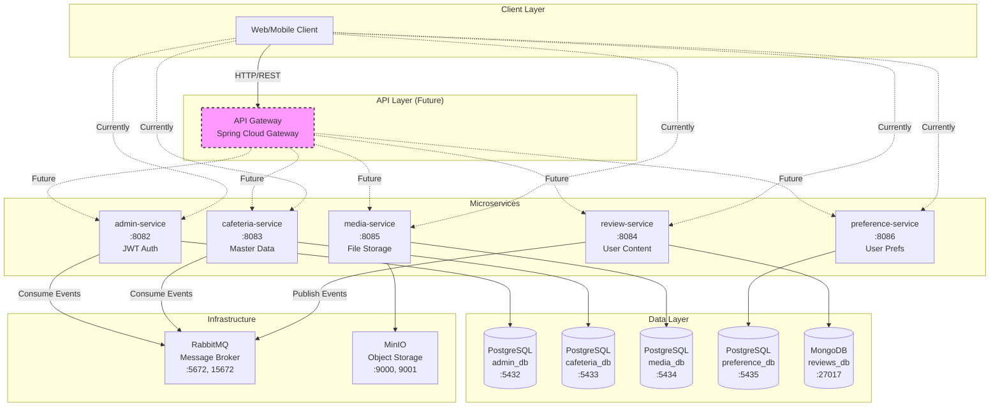
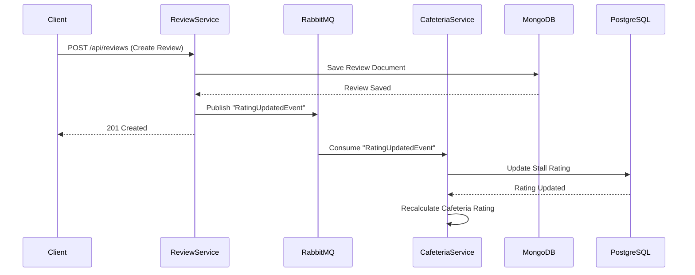

# NUSHungry Backend - System Architecture

## Table of Contents
- [Overview](#overview)
- [Architecture Diagram](#architecture-diagram)
- [Design Principles](#design-principles)
- [Microservices Details](#microservices-details)
- [Data Management](#data-management)
- [Communication Patterns](#communication-patterns)
- [Infrastructure](#infrastructure)
- [Security Architecture](#security-architecture)
- [Scalability & Performance](#scalability--performance)
- [Design Patterns](#design-patterns)

---

## Overview

The NUSHungry backend has evolved from a monolithic Spring Boot application to a **microservices architecture** to address scalability, maintainability, and deployment challenges. The system is designed to handle food discovery, reviews, and user preferences for NUS students.

### Key Characteristics
- **Service Count**: 5 independent microservices
- **Deployment Model**: Docker containers orchestrated via Docker Compose / AWS ECS
- **Communication**: Synchronous (REST) + Asynchronous (RabbitMQ events)
- **Data Storage**: Polyglot persistence (PostgreSQL + MongoDB)
- **Observability**: Health checks, structured logging, metrics endpoints

---

## Architecture Diagram

### High-Level System Architecture



### Event-Driven Data Flow



---

## Design Principles

### 1. Service Independence
- **Database per Service**: Each microservice owns its data schema
- **Independent Deployment**: Services can be deployed without coordinating with others
- **Technology Flexibility**: Services can use different tech stacks if needed

### 2. Event-Driven Architecture
- **Loose Coupling**: Services communicate via events, not direct calls
- **Eventual Consistency**: Data synchronization happens asynchronously
- **Resilience**: Services continue to function even if message broker is temporarily down

### 3. Polyglot Persistence
- **PostgreSQL**: Relational data (users, cafeterias, stalls, preferences)
- **MongoDB**: Document-based data (reviews with nested comments, flexible schema)
- **MinIO**: Object storage (images, files)

### 4. API-First Design
- **RESTful APIs**: Standard HTTP methods (GET, POST, PUT, DELETE)
- **Swagger/OpenAPI**: Auto-generated API documentation
- **Consistent Response Format**: Standardized error handling and response structure

### 5. Containerization
- **Docker Images**: Each service packaged as a Docker image
- **Environment Parity**: Same container runs in dev, staging, and production
- **Portability**: Easy migration between cloud providers

---

## Microservices Details

### 1. admin-service (Port 8082)

#### Responsibilities
- User authentication and authorization (JWT)
- User CRUD operations
- Role-based access control (RBAC)
- Admin dashboard statistics
- Password reset workflow (email verification)

#### Technology
- **Framework**: Spring Boot 3.2.3, Spring Security
- **Database**: PostgreSQL (admin_db)
- **Authentication**: JWT (jjwt library)
- **Email**: Spring Mail (SMTP)

#### Key Endpoints
```
POST   /api/auth/register          # User registration
POST   /api/auth/login             # JWT authentication
POST   /api/auth/forgot-password   # Password reset request
POST   /api/auth/reset-password    # Password reset confirmation
GET    /api/admin/users            # List all users (Admin only)
PUT    /api/admin/users/{id}       # Update user (Admin only)
DELETE /api/admin/users/{id}       # Delete user (Admin only)
GET    /api/admin/dashboard/stats  # Dashboard statistics
```

#### Database Schema
```sql
users (
    id BIGSERIAL PRIMARY KEY,
    username VARCHAR(50) UNIQUE NOT NULL,
    email VARCHAR(100) UNIQUE NOT NULL,
    password_hash VARCHAR(255) NOT NULL,
    role VARCHAR(20) DEFAULT 'USER',
    enabled BOOLEAN DEFAULT true,
    created_at TIMESTAMP DEFAULT CURRENT_TIMESTAMP,
    updated_at TIMESTAMP DEFAULT CURRENT_TIMESTAMP
)

password_reset_codes (
    id BIGSERIAL PRIMARY KEY,
    user_id BIGINT REFERENCES users(id),
    code VARCHAR(6) NOT NULL,
    expires_at TIMESTAMP NOT NULL,
    used BOOLEAN DEFAULT false,
    created_at TIMESTAMP DEFAULT CURRENT_TIMESTAMP
)
```

---

### 2. cafeteria-service (Port 8083)

#### Responsibilities
- Cafeteria and stall master data management
- Geographic location tracking (coordinates)
- Operating hours management
- Real-time rating aggregation (via RabbitMQ events)
- Image association with cafeterias/stalls
- Advanced search and filtering

#### Technology
- **Framework**: Spring Boot 3.2.3, Spring Data JPA
- **Database**: PostgreSQL (cafeteria_db)
- **Messaging**: RabbitMQ (consume RatingUpdatedEvent)

#### Key Endpoints
```
GET    /api/cafeterias             # List all cafeterias
GET    /api/cafeterias/{id}        # Cafeteria details
GET    /api/stalls                 # List all stalls
GET    /api/stalls/{id}            # Stall details
GET    /api/stalls/cafeteria/{id}  # Stalls by cafeteria
POST   /api/admin/cafeterias       # Create cafeteria (Admin)
PUT    /api/admin/cafeterias/{id}  # Update cafeteria (Admin)
DELETE /api/admin/cafeterias/{id}  # Delete cafeteria (Admin)
```

#### Database Schema
```sql
cafeteria (
    id BIGSERIAL PRIMARY KEY,
    name VARCHAR(100) NOT NULL,
    location VARCHAR(255),
    latitude DECIMAL(9,6),
    longitude DECIMAL(9,6),
    description TEXT,
    average_rating DECIMAL(3,2) DEFAULT 0,
    total_reviews INT DEFAULT 0,
    created_at TIMESTAMP DEFAULT CURRENT_TIMESTAMP,
    updated_at TIMESTAMP DEFAULT CURRENT_TIMESTAMP
)

stall (
    id BIGSERIAL PRIMARY KEY,
    cafeteria_id BIGINT REFERENCES cafeteria(id),
    name VARCHAR(100) NOT NULL,
    cuisine_type VARCHAR(50),
    description TEXT,
    average_rating DECIMAL(3,2) DEFAULT 0,
    total_reviews INT DEFAULT 0,
    opening_hours VARCHAR(255),
    created_at TIMESTAMP DEFAULT CURRENT_TIMESTAMP,
    updated_at TIMESTAMP DEFAULT CURRENT_TIMESTAMP
)

image (
    id BIGSERIAL PRIMARY KEY,
    cafeteria_id BIGINT REFERENCES cafeteria(id),
    stall_id BIGINT REFERENCES stall(id),
    url VARCHAR(500) NOT NULL,
    alt_text VARCHAR(255),
    created_at TIMESTAMP DEFAULT CURRENT_TIMESTAMP
)
```

#### Event Consumption
**RatingUpdatedEvent** (from review-service):
```json
{
  "stallId": 1,
  "newAverageRating": 4.5,
  "totalReviews": 42,
  "timestamp": "2024-10-19T10:30:00Z"
}
```

---

### 3. review-service (Port 8084)

#### Responsibilities
- Review creation, update, deletion
- Like/unlike functionality
- Comment system (nested replies)
- Event publishing to RabbitMQ (rating updates)
- Full-text search capabilities

#### Technology
- **Framework**: Spring Boot 3.2.3, Spring Data MongoDB
- **Database**: MongoDB (reviews_db)
- **Messaging**: RabbitMQ (publish RatingUpdatedEvent)

#### Key Endpoints
```
POST   /api/reviews                # Create review
GET    /api/reviews/{id}           # Review details
PUT    /api/reviews/{id}           # Update review
DELETE /api/reviews/{id}           # Delete review
GET    /api/reviews/stall/{id}     # Reviews by stall
POST   /api/reviews/{id}/like      # Like review
DELETE /api/reviews/{id}/like      # Unlike review
POST   /api/reviews/{id}/comments  # Add comment
```

#### MongoDB Document Schema
```javascript
{
  "_id": ObjectId("..."),
  "userId": 123,
  "userName": "John Doe",
  "stallId": 1,
  "stallName": "Western Food",
  "rating": 4,
  "content": "Great food and service!",
  "likesCount": 15,
  "likedBy": [123, 456, 789],  // User IDs
  "comments": [
    {
      "commentId": "abc123",
      "userId": 456,
      "userName": "Jane Smith",
      "content": "I agree!",
      "createdAt": ISODate("2024-10-19T10:00:00Z"),
      "replies": [
        {
          "replyId": "def456",
          "userId": 123,
          "userName": "John Doe",
          "content": "Thanks!",
          "createdAt": ISODate("2024-10-19T10:05:00Z")
        }
      ]
    }
  ],
  "createdAt": ISODate("2024-10-19T09:00:00Z"),
  "updatedAt": ISODate("2024-10-19T10:00:00Z")
}
```

#### Event Publishing
When a review is created/updated/deleted, publishes **RatingUpdatedEvent**:
```java
RatingUpdatedEvent event = RatingUpdatedEvent.builder()
    .stallId(review.getStallId())
    .newAverageRating(calculateAverageRating(stallId))
    .totalReviews(countReviewsByStall(stallId))
    .timestamp(Instant.now())
    .build();
    
rabbitTemplate.convertAndSend("rating.exchange", "rating.updated", event);
```

---

### 4. media-service (Port 8085)

#### Responsibilities
- Multi-format image upload (JPEG, PNG, WebP)
- Image processing (resizing, compression)
- MinIO object storage integration
- File metadata tracking
- Association with cafeterias/stalls/reviews

#### Technology
- **Framework**: Spring Boot 3.2.3, Spring Web
- **Database**: PostgreSQL (media_db)
- **Storage**: MinIO (S3-compatible object storage)
- **Image Processing**: Thumbnailator library

#### Key Endpoints
```
POST   /media/upload               # Upload single file
POST   /media/upload/batch         # Upload multiple files
GET    /media/{id}                 # Get file metadata
DELETE /media/{id}                 # Delete file
GET    /media/cafeteria/{id}       # Files by cafeteria
GET    /media/stall/{id}           # Files by stall
```

#### Database Schema
```sql
media_files (
    id BIGSERIAL PRIMARY KEY,
    original_filename VARCHAR(255) NOT NULL,
    stored_filename VARCHAR(255) UNIQUE NOT NULL,
    file_path VARCHAR(500) NOT NULL,
    file_size BIGINT NOT NULL,
    mime_type VARCHAR(100),
    entity_type VARCHAR(50),        -- 'cafeteria', 'stall', 'review'
    entity_id BIGINT,
    uploaded_by BIGINT,             -- User ID
    created_at TIMESTAMP DEFAULT CURRENT_TIMESTAMP
)

image_metadata (
    id BIGSERIAL PRIMARY KEY,
    media_file_id BIGINT REFERENCES media_files(id),
    width INT,
    height INT,
    format VARCHAR(10),
    thumbnail_path VARCHAR(500),
    created_at TIMESTAMP DEFAULT CURRENT_TIMESTAMP
)
```

---

### 5. preference-service (Port 8086)

#### Responsibilities
- User favorites management
- Search history tracking
- Batch operations (add/remove multiple favorites)
- Privacy-focused (user data isolation)

#### Technology
- **Framework**: Spring Boot 3.2.3, Spring Data JPA
- **Database**: PostgreSQL (preference_db)

#### Key Endpoints
```
POST   /preference/favorites        # Add favorite
DELETE /preference/favorites/{id}   # Remove favorite
GET    /preference/favorites        # List user favorites
POST   /preference/favorites/batch  # Batch add favorites
DELETE /preference/favorites/batch  # Batch remove favorites
POST   /preference/search-history   # Add search history
GET    /preference/search-history   # Get search history
DELETE /preference/search-history   # Clear search history
```

#### Database Schema
```sql
favorites (
    id BIGSERIAL PRIMARY KEY,
    user_id BIGINT NOT NULL,
    stall_id BIGINT NOT NULL,
    created_at TIMESTAMP DEFAULT CURRENT_TIMESTAMP,
    UNIQUE(user_id, stall_id)       -- Prevent duplicate favorites
)

search_history (
    id BIGSERIAL PRIMARY KEY,
    user_id BIGINT NOT NULL,
    keyword VARCHAR(255) NOT NULL,
    search_time TIMESTAMP DEFAULT CURRENT_TIMESTAMP
)
```

---

## Data Management

### Database-per-Service Pattern

Each microservice has its own database to ensure:
- **Data Ownership**: Clear boundaries for data responsibility
- **Independent Scaling**: Scale databases based on individual service load
- **Schema Evolution**: Change database schema without affecting other services
- **Technology Flexibility**: Use the best database for each service's needs

### Polyglot Persistence Strategy

| Service | Database | Justification |
|---------|----------|---------------|
| admin-service | PostgreSQL | Relational data, ACID transactions for auth |
| cafeteria-service | PostgreSQL | Relational data, foreign keys, complex queries |
| review-service | **MongoDB** | Flexible schema, nested comments, document-based |
| media-service | PostgreSQL + MinIO | Metadata in SQL, files in object storage |
| preference-service | PostgreSQL | Simple relational data, user isolation |

### Data Consistency Patterns

#### 1. Strong Consistency (within service)
- Database transactions ensure ACID properties
- Example: User registration in admin-service

#### 2. Eventual Consistency (across services)
- Asynchronous event propagation via RabbitMQ
- Example: Review rating → Stall rating update
- Trade-off: Temporary inconsistency for better availability

#### 3. Data Duplication Strategy
- **Minimal duplication**: Only essential data (e.g., user ID, stall ID)
- **Source of truth**: Each entity has a single owner service
- **Read-optimized**: Duplicate data for query performance

### Data Migration from Monolith

Migration scripts available in each service's `scripts/` folder:
- `init_admin_db.sql`: User and auth data
- `init_cafeteria_db.sql`: Cafeteria and stall data
- `migrate_reviews_to_mongodb.py`: Reviews to MongoDB
- `init_media_db.sql`: Media metadata
- `init_preference_db.sql`: Favorites and search history

---

## Communication Patterns

### 1. Synchronous Communication (REST/HTTP)

**Client → Service**: Direct HTTP requests
- **Pros**: Simple, immediate response, easy debugging
- **Cons**: Tight coupling, cascading failures

**Use Cases**:
- User login (admin-service)
- Fetch cafeteria list (cafeteria-service)
- Get user favorites (preference-service)

### 2. Asynchronous Communication (RabbitMQ)

**Service → Event → Service**: Publish/subscribe model
- **Pros**: Loose coupling, fault tolerance, scalability
- **Cons**: Eventual consistency, harder to debug

**Use Cases**:
- Review created → Update stall rating (review-service → cafeteria-service)

#### RabbitMQ Configuration

**Exchange**: `rating.exchange` (Topic)  
**Queue**: `rating.updated.queue`  
**Routing Key**: `rating.updated`

**Event Flow**:
```
review-service (Publisher)
  → rating.exchange
    → rating.updated (routing key)
      → rating.updated.queue
        → cafeteria-service (Consumer)
```

**Dead Letter Queue (DLQ)**:
- Failed messages retry up to 3 times
- After 3 failures, sent to `rating.updated.dlq` for manual inspection

---

## Infrastructure

### 1. Docker Containerization

Each service has:
- **Dockerfile**: Multi-stage build (Maven build + JRE runtime)
- **docker-compose.yml**: Local development environment
- **.dockerignore**: Optimize build context

Example Dockerfile structure:
```dockerfile
# Stage 1: Build
FROM maven:3.8-openjdk-17 AS build
WORKDIR /app
COPY pom.xml .
RUN mvn dependency:go-offline
COPY src ./src
RUN mvn clean package -DskipTests

# Stage 2: Runtime
FROM openjdk:17-jdk-slim
WORKDIR /app
COPY --from=build /app/target/*.jar app.jar
EXPOSE 8082
ENTRYPOINT ["java", "-jar", "app.jar"]
```

### 2. Global Orchestration

**Root `docker-compose.yml`** orchestrates:
- All 5 microservices
- PostgreSQL (4 instances, different ports)
- MongoDB
- RabbitMQ
- MinIO

**Networking**:
- All services in `nushungry-network` bridge network
- Internal DNS resolution by service name

**Volumes**:
- Persistent data for databases
- Shared volumes for file uploads

### 3. Health Checks

All services expose **Spring Boot Actuator** endpoints:
```
GET /actuator/health        # Health status
GET /actuator/info          # Application info
GET /actuator/metrics       # Metrics
```

Docker health checks:
```yaml
healthcheck:
  test: ["CMD", "curl", "-f", "http://localhost:8082/actuator/health"]
  interval: 30s
  timeout: 10s
  retries: 3
```

### 4. Environment Configuration

**`.env` file** centralizes configuration:
```bash
# Database
POSTGRES_USER=postgres
POSTGRES_PASSWORD=secure_password

# RabbitMQ
RABBITMQ_USER=guest
RABBITMQ_PASSWORD=guest

# JWT
JWT_SECRET=your-secret-key-256-bits
JWT_EXPIRATION=86400000  # 24 hours in milliseconds

# MinIO
MINIO_ROOT_USER=minioadmin
MINIO_ROOT_PASSWORD=minioadmin
```

**Service-specific** `application.properties`:
```properties
spring.datasource.url=jdbc:postgresql://${DB_HOST:localhost}:${DB_PORT:5432}/${DB_NAME}
spring.datasource.username=${DB_USER}
spring.datasource.password=${DB_PASSWORD}

spring.rabbitmq.host=${RABBITMQ_HOST:localhost}
spring.rabbitmq.username=${RABBITMQ_USER}
spring.rabbitmq.password=${RABBITMQ_PASSWORD}
```

---

## Security Architecture

### 1. Authentication & Authorization (admin-service)

#### JWT Token Structure
```json
{
  "sub": "john.doe@example.com",
  "userId": 123,
  "role": "USER",
  "iat": 1634567890,
  "exp": 1634654290
}
```

#### Token Flow
1. User logs in → admin-service validates credentials
2. admin-service generates JWT with user claims
3. Client stores JWT (localStorage/cookie)
4. Client includes JWT in `Authorization: Bearer <token>` header
5. Each service validates JWT using shared secret

#### Security Configuration
```java
@Configuration
@EnableWebSecurity
public class SecurityConfig {
    @Bean
    public SecurityFilterChain filterChain(HttpSecurity http) {
        http
            .csrf().disable()
            .authorizeHttpRequests()
                .requestMatchers("/api/auth/**").permitAll()
                .requestMatchers("/api/admin/**").hasRole("ADMIN")
                .anyRequest().authenticated()
            .and()
            .addFilterBefore(jwtAuthFilter, UsernamePasswordAuthenticationFilter.class);
        return http.build();
    }
}
```

### 2. Password Security
- **Hashing**: BCrypt (cost factor 12)
- **Salt**: Automatically generated per password
- **Storage**: Only hash stored, never plaintext

### 3. Service-to-Service Security (Future)

**Planned Improvements**:
- Mutual TLS (mTLS) for inter-service communication
- Service mesh (Istio) for automated encryption
- API keys for internal service authentication

### 4. Data Protection
- **Database encryption**: TLS for all database connections
- **Object storage**: MinIO encryption at rest
- **Environment secrets**: Never committed to Git, use `.env` or secret managers

---

## Scalability & Performance

### 1. Horizontal Scaling

Each service can scale independently:
```bash
# Scale cafeteria-service to 3 instances
docker-compose up -d --scale cafeteria-service=3
```

**Load Balancing** (Future):
- API Gateway distributes requests
- Round-robin or least connections strategy

### 2. Database Performance

#### Indexing Strategy
```sql
-- cafeteria-service
CREATE INDEX idx_stall_cafeteria_id ON stall(cafeteria_id);
CREATE INDEX idx_stall_rating ON stall(average_rating DESC);

-- preference-service
CREATE INDEX idx_favorites_user_id ON favorites(user_id);
CREATE UNIQUE INDEX idx_favorites_user_stall ON favorites(user_id, stall_id);
```

#### Connection Pooling
```properties
spring.datasource.hikari.maximum-pool-size=20
spring.datasource.hikari.minimum-idle=5
spring.datasource.hikari.connection-timeout=30000
```

### 3. Caching Strategy (Future)

**Planned Integrations**:
- **Redis** for session storage and frequently accessed data
- **Cache Patterns**:
  - Cache-aside for cafeteria/stall details
  - Write-through for user preferences
  - Time-based expiration (TTL)

### 4. Message Queue Performance

**RabbitMQ Tuning**:
- **Prefetch Count**: Limit concurrent messages per consumer
- **Acknowledgment Mode**: Manual ack for reliability
- **Connection Pooling**: Reuse connections for publishers

---

## Design Patterns

### 1. Repository Pattern
- **Interface**: Define data access contracts
- **Implementation**: JpaRepository / MongoRepository
- **Benefit**: Decouple business logic from data access

### 2. Service Layer Pattern
- **Controller**: Handle HTTP requests/responses
- **Service**: Business logic and orchestration
- **Repository**: Data persistence
- **Benefit**: Separation of concerns, testability

### 3. DTO (Data Transfer Object) Pattern
- **Purpose**: Transfer data between layers
- **Mapping**: MapStruct or manual conversion
- **Benefit**: Avoid exposing entity internals

### 4. Event Sourcing (Partial)
- **review-service**: Publishes domain events
- **cafeteria-service**: Consumes events to update state
- **Benefit**: Audit trail, eventual consistency

### 5. Circuit Breaker (Future)
- **Resilience4j**: Prevent cascading failures
- **Fallback**: Return cached data or default response
- **Benefit**: Fault tolerance

---

## Future Enhancements

### 1. API Gateway (Spring Cloud Gateway)
- Centralized entry point for all services
- Request routing based on path
- Rate limiting and throttling
- JWT validation at gateway level

### 2. Service Discovery (Eureka)
- Dynamic service registration
- Client-side load balancing
- Health monitoring

### 3. Distributed Tracing (Zipkin/Jaeger)
- Trace requests across services
- Identify performance bottlenecks
- Visualize service dependencies

### 4. Centralized Logging (ELK Stack)
- Elasticsearch: Store logs
- Logstash/Filebeat: Ship logs
- Kibana: Visualize and query logs

### 5. Monitoring (Prometheus + Grafana)
- Metrics collection from Actuator
- Alerting for critical thresholds
- Custom dashboards

### 6. Configuration Server (Spring Cloud Config)
- Centralized configuration management
- Environment-specific configs
- Hot reload without restart

---

## Conclusion

The NUSHungry microservices architecture provides:
- ✅ **Scalability**: Independent service scaling
- ✅ **Maintainability**: Clear service boundaries
- ✅ **Resilience**: Fault isolation and graceful degradation
- ✅ **Flexibility**: Technology choices per service
- ✅ **Deployment**: Independent release cycles

This architecture supports the current scale and provides a foundation for future growth and feature additions.
