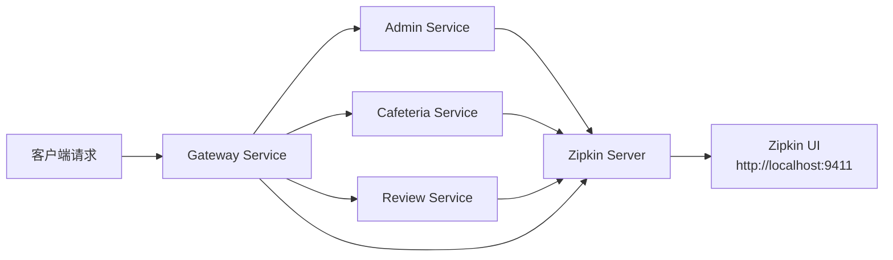

# 分布式追踪 (Distributed Tracing)

## 📋 目录

- [概述](#概述)
- [技术栈](#技术栈)
- [架构设计](#架构设计)
- [快速开始](#快速开始)
- [配置说明](#配置说明)
- [使用指南](#使用指南)
- [追踪示例](#追踪示例)
- [故障排查](#故障排查)
- [最佳实践](#最佳实践)
- [性能优化](#性能优化)

---

## 概述

NUSHungry 微服务架构采用 **Micrometer Tracing** + **Zipkin** 实现分布式追踪，用于：

- ✅ 跟踪跨多个微服务的请求流程
- ✅ 识别性能瓶颈和延迟来源
- ✅ 分析服务间依赖关系
- ✅ 调试分布式系统中的问题
- ✅ 监控服务健康状态和SLA

### 为什么需要分布式追踪？

在微服务架构中，一个用户请求可能会经过多个服务：

```
客户端 → Gateway → Admin Service → RabbitMQ → Cafeteria Service
```

传统的单体应用日志无法追踪整个调用链。分布式追踪通过为每个请求分配唯一的 **Trace ID**，并记录每个服务的 **Span ID**，实现完整的请求路径可视化。

---

## 技术栈

| 组件 | 版本 | 作用 |
|-----|------|-----|
| **Micrometer Tracing** | 1.2.x | 追踪抽象层（与Spring Boot 3.2.3兼容） |
| **Brave** | 6.0.x | 追踪实现（OpenZipkin） |
| **Zipkin Server** | latest | 追踪数据收集和可视化 |
| **Spring Boot Actuator** | 3.2.3 | 暴露追踪端点 |

### 依赖关系

```xml
<!-- 所有微服务的 pom.xml 已添加 -->
<dependency>
    <groupId>io.micrometer</groupId>
    <artifactId>micrometer-tracing-bridge-brave</artifactId>
</dependency>
<dependency>
    <groupId>io.zipkin.reporter2</groupId>
    <artifactId>zipkin-reporter-brave</artifactId>
</dependency>
```

---

## 架构设计

### 追踪流程



### 关键概念

- **Trace（追踪）**: 一次完整的请求流程，包含多个 Span
- **Span（跨度）**: 单个服务内的操作，包含开始时间、结束时间、标签等
- **Trace ID**: 全局唯一标识符，贯穿整个请求链路
- **Span ID**: Span 的唯一标识符
- **Parent Span ID**: 父 Span 的 ID，用于构建调用树

### 数据流

1. 用户发起请求到 Gateway
2. Gateway 生成 Trace ID 和第一个 Span
3. Gateway 调用下游服务时传递 Trace ID
4. 每个服务创建自己的 Span 并关联到同一个 Trace
5. 所有 Span 异步上报到 Zipkin Server
6. Zipkin UI 聚合展示完整调用链

---

## 快速开始

### 1. 启动 Zipkin Server

#### 使用 Docker Compose（推荐）

```bash
# 在项目根目录
docker-compose up -d zipkin
```

#### 独立启动 Zipkin

```bash
docker run -d -p 9411:9411 --name zipkin openzipkin/zipkin:latest
```

### 2. 启动微服务

```bash
# 使用 Docker Compose 启动所有服务
docker-compose up -d

# 或者逐个启动微服务
docker-compose up -d admin-service cafeteria-service review-service media-service preference-service gateway-service
```

### 3. 访问 Zipkin UI

打开浏览器访问：**http://localhost:9411**

### 4. 生成追踪数据

```bash
# 示例：调用 API 生成追踪
curl -X GET "http://localhost:8080/api/cafeterias"
```

### 5. 查看追踪

1. 在 Zipkin UI 点击 "Find a trace"
2. 点击 "RUN QUERY" 查看最近的追踪
3. 点击任意 Trace 查看详细调用链

---

## 配置说明

### 环境变量（Docker）

所有微服务已在 `docker-compose.yml` 中配置：

```yaml
environment:
  # Zipkin 服务器地址
  MANAGEMENT_ZIPKIN_TRACING_ENDPOINT: http://zipkin:9411/api/v2/spans

  # 采样率（1.0 = 100%，建议生产环境设为 0.1）
  MANAGEMENT_TRACING_SAMPLING_PROBABILITY: 1.0
```

### 应用配置（application.properties）

如果需要在 application.properties 中配置：

```properties
# Zipkin 配置
management.zipkin.tracing.endpoint=http://localhost:9411/api/v2/spans
management.tracing.sampling.probability=1.0

# 日志关联（自动包含 traceId 和 spanId）
logging.pattern.level=%5p [${spring.application.name:},%X{traceId:-},%X{spanId:-}]
```

### Config Server 配置

如果使用 Config Server，可在 `config-repo/application.yml` 中统一配置：

```yaml
management:
  zipkin:
    tracing:
      endpoint: ${ZIPKIN_ENDPOINT:http://zipkin:9411/api/v2/spans}
  tracing:
    sampling:
      probability: ${TRACING_SAMPLING_PROBABILITY:1.0}
```

### 采样率建议

| 环境 | 采样率 | 说明 |
|-----|--------|------|
| **开发环境** | 1.0 (100%) | 捕获所有请求，便于调试 |
| **测试环境** | 0.5 (50%) | 适度采样，降低资源消耗 |
| **生产环境** | 0.1 (10%) | 生产环境推荐值，平衡性能和可观测性 |
| **高流量系统** | 0.01 (1%) | 超大规模系统，避免Zipkin过载 |

---

## 使用指南

### 在 Zipkin UI 中查看追踪

#### 1. 查找追踪

- **按服务名**: 选择特定服务（如 `gateway-service`）
- **按时间范围**: 调整时间范围查找历史追踪
- **按标签**: 使用自定义标签过滤（如 `http.status_code=500`）
- **按最小持续时间**: 查找慢请求（如 `>1s`）

#### 2. 分析调用链

Zipkin UI 显示：
- **Span 瀑布图**: 可视化服务调用顺序和耗时
- **服务依赖图**: 查看服务间依赖关系
- **Span 详情**: 查看标签、日志、错误信息

#### 3. 识别性能问题

- **查找最慢的 Span**: 识别性能瓶颈
- **分析并发 Span**: 检查是否有串行调用可以并行化
- **检查重复调用**: 发现 N+1 查询问题

### 日志关联

Spring Boot 自动将 `traceId` 和 `spanId` 添加到 MDC（Mapped Diagnostic Context），日志格式：

```
2025-10-20 INFO [admin-service,64d8e6c7f8f9a123,64d8e6c7f8f9a123] Processing login request
```

格式说明：
- `admin-service`: 服务名
- `64d8e6c7f8f9a123`: Trace ID
- `64d8e6c7f8f9a123`: Span ID

### 自定义 Span

如果需要手动创建 Span：

```java
import io.micrometer.observation.Observation;
import io.micrometer.observation.ObservationRegistry;

@Service
public class MyService {
    private final ObservationRegistry observationRegistry;

    public MyService(ObservationRegistry observationRegistry) {
        this.observationRegistry = observationRegistry;
    }

    public void businessMethod() {
        Observation observation = Observation.createNotStarted("business-operation", observationRegistry)
                .lowCardinalityKeyValue("operation.type", "database")
                .highCardinalityKeyValue("user.id", "12345")
                .start();

        try {
            // 业务逻辑
            performDatabaseOperation();
        } catch (Exception e) {
            observation.error(e);
            throw e;
        } finally {
            observation.stop();
        }
    }
}
```

### 添加自定义标签

```java
import brave.Span;
import brave.Tracer;

@RestController
public class MyController {
    private final Tracer tracer;

    public MyController(Tracer tracer) {
        this.tracer = tracer;
    }

    @GetMapping("/api/example")
    public ResponseEntity<?> example(@RequestParam String userId) {
        Span currentSpan = tracer.currentSpan();
        if (currentSpan != null) {
            currentSpan.tag("user.id", userId);
            currentSpan.tag("request.type", "example");
        }
        // 业务逻辑
        return ResponseEntity.ok().build();
    }
}
```

---

## 追踪示例

### 示例 1：用户登录流程

**请求路径**:
```
POST /api/admin/auth/login
→ Gateway Service (JWT验证)
→ Admin Service (用户认证)
→ PostgreSQL (查询用户)
→ RabbitMQ (发送登录事件)
```

**Zipkin 追踪视图**:
```
Trace ID: abc123def456
├── gateway-service: POST /api/admin/auth/login (50ms)
│   ├── JWT validation (5ms)
│   └── route-to-admin-service (45ms)
└── admin-service: /auth/login (45ms)
    ├── findUserByEmail (20ms)
    ├── passwordEncoder.matches (15ms)
    └── rabbitmq.send (10ms)
```

### 示例 2：获取食堂列表

**请求路径**:
```
GET /api/cafeterias
→ Gateway Service
→ Cafeteria Service (查询数据库)
→ Redis Cache (查询缓存)
```

**Zipkin 追踪视图**:
```
Trace ID: xyz789ghi012
├── gateway-service: GET /api/cafeterias (25ms)
└── cafeteria-service: /cafeterias (25ms)
    ├── cache.get (2ms) [HIT]
    └── return cached data (23ms)
```

### 示例 3：跨服务错误追踪

**请求路径**:
```
POST /api/reviews
→ Gateway Service
→ Review Service (创建评论)
→ RabbitMQ (发布评分更新事件)
→ Cafeteria Service (更新评分) [失败]
```

**Zipkin 追踪视图**:
```
Trace ID: err500abc123
├── gateway-service: POST /api/reviews (150ms)
└── review-service: /reviews (150ms)
    ├── mongodb.insert (50ms) [成功]
    └── rabbitmq.publish (100ms)
        └── cafeteria-service: update-rating (100ms) [错误]
            └── ERROR: Connection timeout to PostgreSQL
```

---

## 故障排查

### 问题 1：Zipkin UI 没有显示追踪数据

**可能原因**:
1. Zipkin Server 未启动
2. 微服务未正确配置 Zipkin 端点
3. 采样率设置为 0
4. 网络连接问题

**解决方案**:

```bash
# 1. 检查 Zipkin 是否运行
docker ps | grep zipkin
curl http://localhost:9411/health

# 2. 检查微服务日志
docker logs admin-service 2>&1 | grep -i zipkin

# 3. 验证环境变量
docker exec admin-service env | grep ZIPKIN

# 4. 测试网络连接
docker exec admin-service curl -v http://zipkin:9411/api/v2/spans
```

### 问题 2：Trace ID 不一致

**可能原因**:
- Gateway 未正确传递追踪上下文
- 手动创建 HTTP 客户端导致追踪中断

**解决方案**:
使用 Spring Boot 自动配置的客户端：

```java
// ✅ 正确：自动传递追踪上下文
@Autowired
private RestTemplate restTemplate; // 使用 RestTemplateBuilder 创建

// ❌ 错误：手动创建会丢失追踪上下文
RestTemplate restTemplate = new RestTemplate(); // 不要这样做！
```

### 问题 3：采样率不生效

**检查配置优先级**:
1. 环境变量 > application.properties > Config Server
2. 确认配置格式正确：`MANAGEMENT_TRACING_SAMPLING_PROBABILITY=1.0`

```bash
# 验证采样率
curl http://localhost:8082/actuator/metrics/management.tracing.sampling.probability
```

### 问题 4：Zipkin Server 内存不足

**症状**: Zipkin UI 响应慢或崩溃

**解决方案**:

```yaml
# docker-compose.yml
zipkin:
  image: openzipkin/zipkin:latest
  environment:
    - JAVA_OPTS=-Xms512m -Xmx1024m  # 增加内存
    - STORAGE_TYPE=elasticsearch    # 使用持久化存储
```

---

## 最佳实践

### 1. 命名规范

- **Span 名称**: 使用小写加连字符，如 `http-get-cafeterias`
- **标签键**: 使用点分隔命名空间，如 `user.id`、`http.status_code`
- **服务名**: 与 `spring.application.name` 保持一致

### 2. 标签使用

**低基数标签（Low Cardinality）**：值的种类有限
```java
span.tag("http.method", "GET");
span.tag("http.status_code", "200");
span.tag("db.type", "postgresql");
```

**高基数标签（High Cardinality）**：值的种类很多
```java
// 使用 highCardinalityKeyValue 避免内存泄漏
observation.highCardinalityKeyValue("user.id", userId);
observation.highCardinalityKeyValue("request.id", requestId);
```

### 3. 异步操作追踪

使用 `@NewSpan` 或手动传递追踪上下文：

```java
@Service
public class AsyncService {
    private final Tracer tracer;

    @Async
    @NewSpan("async-operation")
    public CompletableFuture<Void> asyncMethod() {
        // 追踪上下文会自动传递
        return CompletableFuture.completedFuture(null);
    }
}
```

### 4. 敏感信息处理

**不要在标签中记录敏感信息**：
- ❌ 密码、Token、API Key
- ❌ 完整的个人信息（如身份证号）
- ❌ 信用卡号

**正确做法**：
```java
// ❌ 错误
span.tag("password", password);

// ✅ 正确
span.tag("user.id", userId.substring(0, 4) + "****");
```

### 5. 生产环境配置

```yaml
management:
  tracing:
    sampling:
      probability: 0.1  # 仅采样 10% 的请求
  zipkin:
    tracing:
      connect-timeout: 1s  # 连接超时
      read-timeout: 3s     # 读取超时
```

---

## 性能优化

### 1. 采样策略

**自适应采样**（需自定义实现）：
- 所有错误请求（HTTP 5xx）：100% 采样
- 慢请求（> 1s）：100% 采样
- 正常快速请求：10% 采样

### 2. 异步上报

Zipkin Reporter 默认使用异步上报，不会阻塞主线程：

```properties
# 配置批量上报参数
zipkin.sender.type=web
zipkin.sender.max-requests=64  # 最大并发请求数
zipkin.sender.message-max-bytes=5242880  # 5MB
```

### 3. Zipkin 存储

**内存存储（开发/测试）**：
```yaml
environment:
  - STORAGE_TYPE=mem
```

**持久化存储（生产）**：
```yaml
environment:
  - STORAGE_TYPE=elasticsearch
  - ES_HOSTS=http://elasticsearch:9200
  - ES_INDEX=zipkin
```

### 4. 网络优化

- 使用 Docker 内部网络（而非 localhost）
- 配置合理的超时时间
- 启用 HTTP/2（Zipkin 支持）

---

## 监控指标

### 关键指标

Zipkin 提供以下监控维度：

| 指标 | 说明 |
|-----|------|
| **P50/P95/P99 延迟** | 请求响应时间百分位 |
| **错误率** | 5xx 响应占比 |
| **服务调用次数** | 每个服务的请求量 |
| **依赖关系** | 服务间调用关系图 |

### Actuator 端点

```bash
# 查看追踪相关指标
curl http://localhost:8082/actuator/metrics | grep tracing

# 查看采样率
curl http://localhost:8082/actuator/metrics/management.tracing.sampling.probability
```

---

## 集成其他工具

### 与 Prometheus + Grafana 集成

1. Micrometer Tracing 自动暴露追踪指标
2. Prometheus 抓取 `/actuator/prometheus` 端点
3. Grafana 创建追踪仪表盘

### 与 ELK Stack 集成

1. 日志自动包含 `traceId` 和 `spanId`
2. Logstash 解析日志并提取追踪 ID
3. Kibana 查询日志时关联 Zipkin 追踪

---

## 参考资料

- [Spring Boot Tracing Documentation](https://docs.spring.io/spring-boot/reference/actuator/tracing.html)
- [Micrometer Tracing Official Docs](https://micrometer.io/docs/tracing)
- [Zipkin Official Site](https://zipkin.io/)
- [OpenZipkin Brave GitHub](https://github.com/openzipkin/brave)

---

## 附录

### 服务端口映射

| 服务 | 端口 | 追踪状态 |
|-----|------|---------|
| gateway-service | 8080 | ✅ 已配置 |
| admin-service | 8082 | ✅ 已配置 |
| cafeteria-service | 8083 | ✅ 已配置 |
| review-service | 8084 | ✅ 已配置 |
| media-service | 8085 | ✅ 已配置 |
| preference-service | 8086 | ✅ 已配置 |
| eureka-server | 8761 | ✅ 已配置 |
| config-server | 8888 | ✅ 已配置 |
| zipkin-server | 9411 | 🔧 Zipkin UI |

### 完整示例：端到端追踪

#### 场景：用户添加收藏

1. **客户端请求**:
   ```bash
   curl -X POST http://localhost:8080/api/favorites \
     -H "Authorization: Bearer <JWT_TOKEN>" \
     -H "Content-Type: application/json" \
     -d '{"stallId": 1}'
   ```

2. **追踪流程**:
   ```
   [Trace ID: abc123]
   ├── gateway-service (10ms)
   │   ├── JWT validation (3ms)
   │   └── route to preference-service (7ms)
   └── preference-service (30ms)
       ├── check duplicate (5ms)
       ├── save to PostgreSQL (15ms)
       └── update cache (10ms)
   ```

3. **在 Zipkin UI 查看**:
   - 访问 http://localhost:9411
   - 搜索 `serviceName=gateway-service`
   - 点击对应的 Trace 查看详情

---

**更新日期**: 2025-10-20
**版本**: 1.0.0
**维护者**: NUSHungry Development Team
